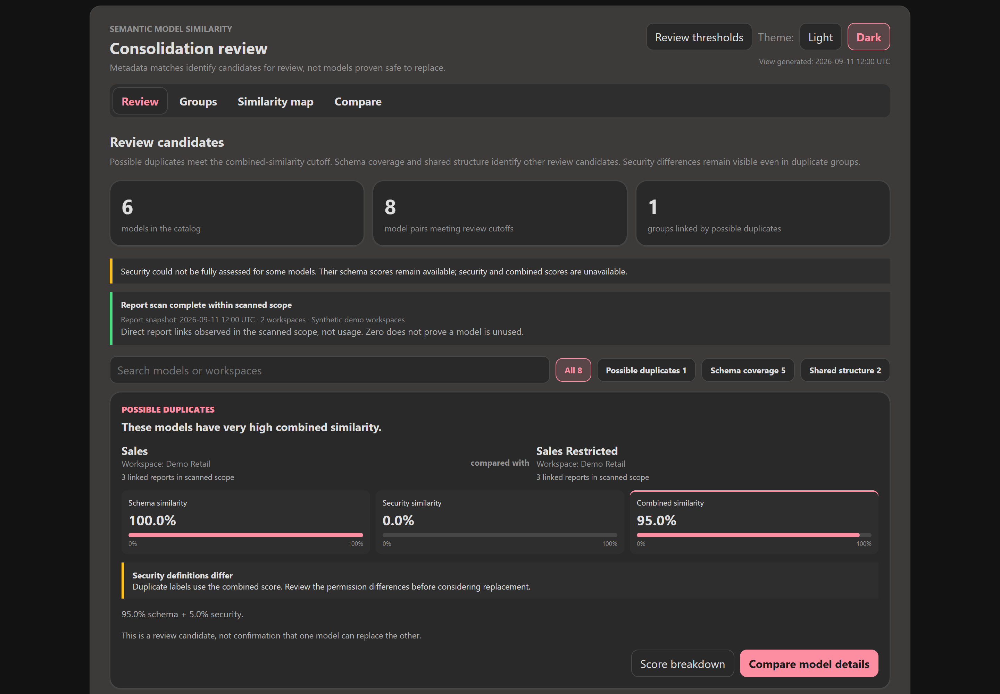

# Semantic Model Similarity

Find likely duplicates and overlapping Microsoft Fabric semantic models, and see the differences that matter before considering consolidation.

Built for BI architects, model owners, and governance teams, this project turns a collection of models into a focused set of review candidates. Compare model definitions, keep security differences visible, and see which reports are directly linked to each model.

*Review candidates with security differences kept in view. Screenshot uses synthetic demo data.*

## What it helps you do

- **Find repeated work.** Surface identical and near-identical model definitions across workspaces.
- **Understand overlap.** Identify smaller models whose definitions are largely represented in larger models.
- **See important differences.** Compare structure, calculations, and security rules side by side.
- **Add report context.** See directly linked reports when reviewing the potential impact of a change.
- **Focus the review.** Explore ranked candidates, related groups, detailed comparisons, and a similarity map.

## From inventory to review

1. **Catalog** the models and report links visible to your Fabric identity.
2. **Compare** model definitions to identify similarities, differences, and schema coverage.
3. **Review** the evidence with model owners before deciding what to consolidate or retain.

The workflow runs in Microsoft Fabric using three notebooks and a shared Lakehouse. It reads source-model metadata without changing your models or reports.

## Before consolidation

Results guide investigation; they do not approve a model for replacement. Matching definitions do not establish matching data, calculation results, or user access, and linked-report counts are not a measure of usage.

See the [project README](README.md) for requirements and setup.
