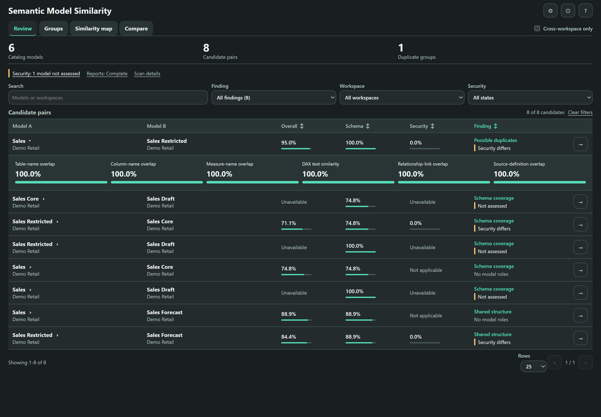

# Semantic Model Similarity

Find likely duplicates and overlapping Microsoft Fabric semantic models, and see the differences that matter before considering consolidation.

Built for BI architects, model owners, and governance teams, this project turns a collection of models into a focused set of review candidates. Compare model definitions, keep security differences visible, and see which reports are directly linked to each model.

*Scan ranked model pairs, compare aligned scores, and keep security differences in view. Synthetic demo data is shown with cross-workspace scope switched off.*

## What it helps you do

- **Find repeated work.** Surface identical and near-identical model definitions across workspaces.
- **Understand overlap.** Identify smaller models whose definitions are largely represented in larger models.
- **See important differences.** Compare structure, calculations, and security rules side by side.
- **Add report context.** See directly linked reports when reviewing the potential impact of a change.
- **Focus the review.** Review all candidate pairs or enable cross-workspace filtering. Explore groups, detailed comparisons, and a similarity map with the same scope.

## From inventory to review

1. **Catalog** models and report links in the selected workspace scopes, optionally using temporary access managed by a Fabric administrator.
2. **Compare** model definitions to identify similarities, differences, and schema coverage.
3. **Review** the evidence with model owners before deciding what to consolidate or retain.

The workflow runs in Microsoft Fabric using two notebooks and a shared Lakehouse: collect and score, then review. It reads source-model metadata without changing your models or reports. An opt-in mode temporarily adds a dedicated security group as a workspace Member during collection and removes that assignment afterward; this changes workspace access, not model definitions.

## Before consolidation

Results guide investigation; they do not approve a model for replacement. Matching definitions do not establish matching data, calculation results, or user access, and linked-report counts are not a measure of usage.

See the [project README](README.md) for requirements and setup.
