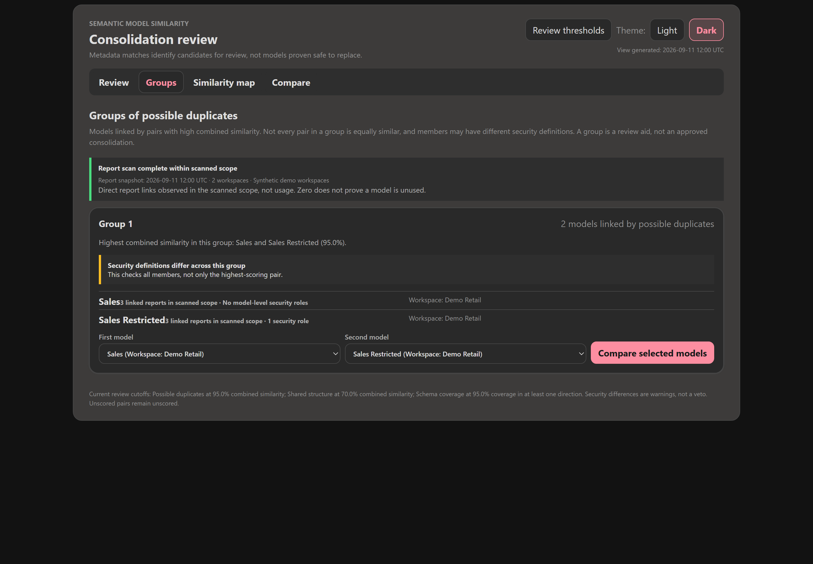
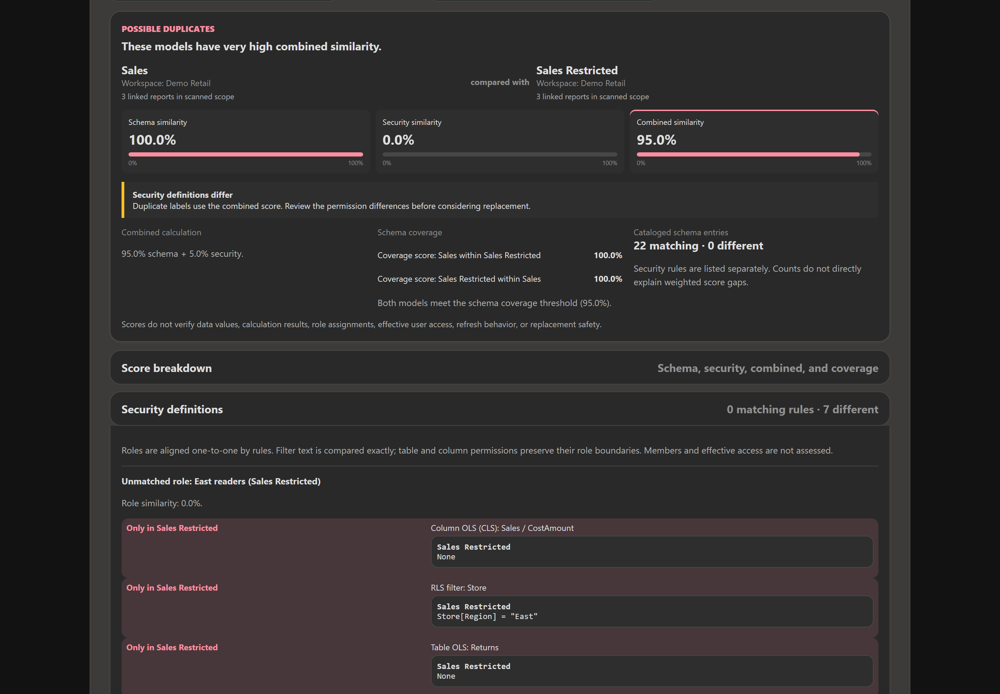
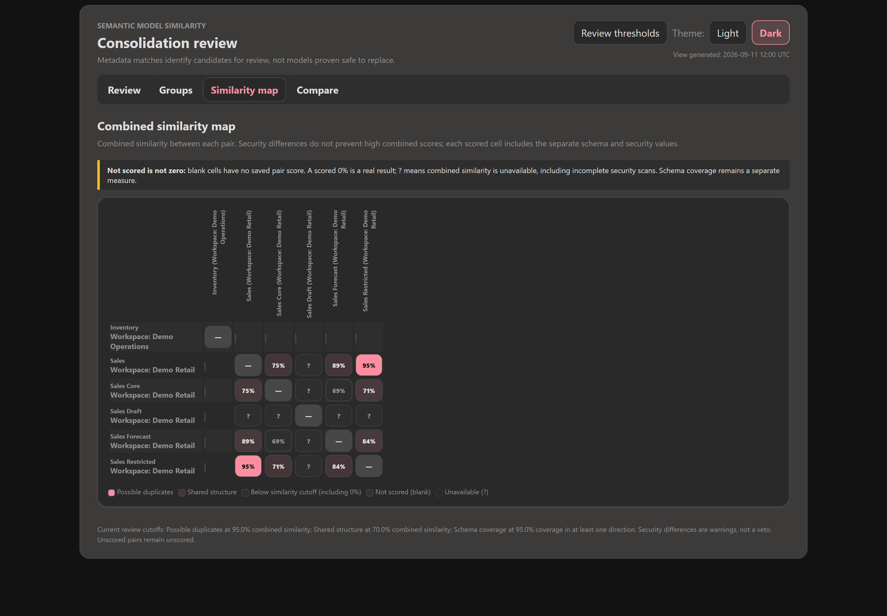

# Semantic Model Similarity

This project catalogs Microsoft Fabric semantic models and their security definitions, calculates separate schema, security, and combined similarity scores, and highlights possible duplicates and schema subset relationships in a notebook workflow.

Screenshots use synthetic demo data rendered by the results notebook in its desktop dark theme.


*Review keeps security differences visible even when a pair meets the possible-duplicate cutoff.*

## What this repo contains

```text
.
├── README.md
├── README.marketing.md
├── CHANGELOG.md
├── RELEASING.md
├── docs/
│   └── images/       # desktop screenshots used in the READMEs
└── notebooks/
    ├── 001_semantic_model_tom_catalog.ipynb
    ├── 002_semantic_model_similarity.ipynb
    └── 003_semantic_model_similarity_results.ipynb
```

The repository is intentionally notebook-first. The catalog notebook extracts metadata from semantic models and writes it to a Lakehouse, the similarity notebook scores and persists model pairs, and the results notebook reads those persisted outputs into a separate interactive review app.

## Downloads and versions

Similarity has its own versions and `similarity/vMAJOR.MINOR.PATCH` tags within
the parent repository. The initial planned release is `0.1.0`, marked as a GitHub
prerelease. See [CHANGELOG.md](CHANGELOG.md) for its contents; publication status
is shown on the [Releases page](https://github.com/MitchSS/semantic-model-analysis/releases).

For a published version, download its named `semantic-model-similarity-vVERSION.zip`
asset and SHA-256 checksum. The ZIP contains only this project's notebooks and
documentation. GitHub's automatic **Source code** downloads contain the whole
repository, including any sibling projects.

Extract the ZIP, import all three notebooks from its `similarity/notebooks/`
folder into Fabric, and attach the same Lakehouse to each. Use notebooks from the
same release and follow the requirements and running order below. Public release
versions are independent of the persisted score/security schema versions.
Maintainers can follow [RELEASING.md](RELEASING.md) to prepare and review a draft;
merging code does not publish a release.

## Workflow

Run the notebooks in this order:

1. [001_semantic_model_tom_catalog.ipynb](notebooks/001_semantic_model_tom_catalog.ipynb)
2. [002_semantic_model_similarity.ipynb](notebooks/002_semantic_model_similarity.ipynb)
3. [003_semantic_model_similarity_results.ipynb](notebooks/003_semantic_model_similarity_results.ipynb)

### 1. Catalog semantic model metadata

The catalog notebook uses Semantic Link Labs and TOM to read the semantic model metadata through the notebook user’s Fabric identity. It discovers visible workspaces and semantic models, opens read-only TOM sessions, and extracts:

- semantic model properties
- data sources
- tables
- columns
- measures and DAX expressions
- relationships
- role permissions, RLS filters, table OLS, column OLS (CLS), and relationship security settings
- per-model security scan status, definition version, counts, and catalog scan ID
- model/workspace errors
- direct Power BI report-to-model bindings, including visible cross-workspace reports
- report workspace scan status, scope, and snapshot timestamp

The notebook writes these Delta tables to the attached Lakehouse:

- `semantic_models`
- `semantic_model_datasources`
- `semantic_model_tables`
- `semantic_model_columns`
- `semantic_model_relationships`
- `semantic_model_measures`
- `semantic_model_catalog_errors`
- `semantic_model_report_dependencies`
- `semantic_model_report_scan`
- `semantic_model_security`

`semantic_model_security` is a typed current snapshot with one row per attempted model. It stores nested role/table/column definitions in `definition_json`, `security_schema_version`, `scan_status`, sanitized `error_type`, nullable counts, `catalog_scan_id`, and `scanned_at`. The same catalog scan ID is included in `semantic_models`. A successful zero-role scan is explicitly recorded; failed or partial reads have null definitions and counts, not invented empty security. This snapshot always overwrites, including when empty.

Collection follows TOM's `Model.Roles` -> `TablePermissions` -> `ColumnPermissions` hierarchy. Column-level security here means column OLS; `IsHidden` is not security. `MetadataPermission=None` is a literal permission value, distinct from an unavailable property. Relationship endpoints, active state, cardinalities, cross-filtering, and `SecurityFilteringBehavior` are captured for RLS propagation comparison. No role members or user/group assignments are read or changed.

The scanning identity must be allowed to inspect the complete model security metadata. Verify visibility against a known protected model before interpreting a role-free scan. A readable model is not proof of effective-user access, and matching dynamic filters do not prove matching access when identity mappings or source data differ. Security definitions can contain sensitive literal values; restrict access to the output Lakehouse and notebook results accordingly.

The catalog supports optional exact filters through `WORKSPACE_NAME` and `MODEL_NAME`. Report discovery is independent: `REPORT_WORKSPACE_NAME = None` scans the report workspaces visible to the notebook identity, even when model discovery is filtered. Set it to an exact workspace name to restrict report scanning. Cross-workspace dependents outside that report scope cannot be discovered.

The report inventory uses [Power BI Reports - Get Reports In Group](https://learn.microsoft.com/en-us/rest/api/power-bi/reports/get-reports-in-group). Bindings use `datasetId`, never model names. Reports with missing model IDs, unsupported report types (including paginated reports), or models outside the catalog remain explicit inventory rows. Missing IDs and unsupported report types make coverage partial; an out-of-catalog model ID remains an observed binding, but its model workspace is unknown.

Each report row includes the report ID, name, workspace, generated report URL, bound model ID, available model/workspace context, binding status, cross-workspace flag, `scan_id`, and `scanned_at`. Scan rows record counts and `complete`, `partial`, or `failed` status for each report workspace. Discovery failures also create a failed scan row. Only sanitized exception types are stored for report scans.

These two report tables are **current snapshots**, always overwritten, including when empty. They do not implement historical change tracking, usage analytics, transitive model lineage, field-level dependencies, report rebinding, or a safety recommendation to retire a model. All counts are limited to the caller's visible, selected scope, not a tenant-wide guarantee.

### 2. Score model similarity and containment

The similarity notebook reads the catalog tables and builds a normalized signature for each semantic model. It then:

- builds candidate pairs
- computes structural Jaccard overlap for tables, columns, measures, relationships, and data sources
- measures DAX/name similarity with a local TF-IDF vectorizer
- preserves the existing six-signal blend as the symmetric **schema similarity score**
- compares security definitions independently of role names to calculate **security similarity**
- calculates **combined similarity**, normally 95% schema plus 5% security
- computes directional **schema containment** from table, column, measure-definition, relationship, and data-source coverage, excluding security
- classifies pairs by combined score as `duplicate`, `similar`, or `distinct`; unavailable combined scores are `unassessed`. Schema containment retains `equivalent`, `model_a_contains_model_b`, `model_b_contains_model_a`, and `partial_overlap` labels
- groups duplicate-tier pairs into connected clusters
- writes the results back to the Lakehouse

The output tables are:

- `semantic_model_signatures` (schema counts, security scan status, canonical definitions, SHA-256 fingerprints, and provenance)
- `semantic_model_similarity_pairs` (`schema_score`, `security_score`, `combined_score`, `score_mode`, `security_comparison_status`, role alignment and component evidence in `security_evidence_json`, plus existing schema containment fields)
- `semantic_model_duplicate_clusters`
- `semantic_model_similarity_run` (thresholds, blocking flag, configured weight dictionaries, timestamp, counts, `analysis_run_id`, and `score_version=2`)

All scored outputs carry an analysis run ID. Pairs and signatures also record their source catalog IDs. `composite_score` retains its previous meaning as the rounded schema-only score for existing consumers; it is **not** an alias for the new combined score. New classifications and clusters use `combined_score`.

#### Score semantics

| Security metadata | Security score | Combined score |
| --- | --- | --- |
| Complete on both sides, with roles on either side | Definition similarity | `0.95 * schema_score + 0.05 * security_score` |
| Both complete scans have no roles | Not applicable (`null`) | Exactly `schema_score` |
| Only one model has roles | 0% | `0.95 * schema_score` |
| Missing, unreadable, partial, unsupported, or inconsistent | Unknown (`null`) | Unavailable (`null`) |

A role is a security definition even if it has no assigned members or no table filters, because its model permission still matters. Assignments are never inspected to determine applicability. `score_mode` distinguishes `combined`, `schema_only_no_security`, and `unavailable_security`.

For example, 100% schema and 0% security yield **95% combined**. The default duplicate cutoff is inclusive at 95%, so this pair still qualifies as a possible duplicate, with a **Security definitions differ** warning. There is no security-equality veto or security-specific minimum. If neither model has roles and schema is 90%, combined is exactly 90%, not 90.5%.

#### Security calculation

Roles are matched one-to-one by their rules using maximum-total-similarity assignment (`scipy.optimize.linear_sum_assignment`). Names are retained for display but do not affect matching. Role multiplicity and boundaries are preserved: splitting one combined role into separate roles is a difference, and one role cannot match multiple roles.

Within a role pair, model permission is an exact match, while RLS, table OLS, and column OLS facts use Jaccard overlap. These four families have equal default weights; families absent from both roles are excluded. Unmatched roles contribute zero, and matched role scores are divided by the larger role count. The security score blends this role-definition score with RLS propagation using default weights of 4:1. Propagation is applicable only when at least one model has RLS propagation facts; otherwise role definitions supply the whole score.

RLS expression text is compared exactly, preserving string literals, case, whitespace, and comment-like text. Formatting-only changes can therefore count as differences. Security does not reuse the schema DAX normalizer or TF-IDF. No-op `Default` table/column declarations are omitted from scoring, while their raw values remain in the catalog. A versioned SHA-256 fingerprint identifies exact canonical definition matches independently of rounded percentages. This is similarity of definitions, not a measure of security strength, compliance, or effective authorization.

Report dependencies are impact context only. They do not affect candidate blocking, similarity weights, containment, or duplicate clustering.

### 3. Review results in the interactive app

The results notebook keeps presentation separate from scoring. Its custom, dependency-free `displayHTML(...)` renderer loads the persisted Delta tables and provides four visible views:

- **Review** - three-score summaries of **Possible duplicates**, **Schema coverage**, and **Shared structure**, with visible security warnings and an expandable **Score breakdown**
- **Groups** - models linked by combined-score duplicate pairs, with security warnings based on all members rather than only the strongest pair
- **Compare** - schema, security, and combined scores; both named schema coverage directions; and separate schema, security-rule, formula-text, and report evidence
- **Similarity map** - combined percentages for all cataloged models, with separate schema/security values and security status in each scored cell's tooltip

The standalone **Reports** tab is temporarily omitted from navigation. Report collection, per-model counts in Review and Groups, and the **Dependent reports** section in Compare remain available. The report inventory renderer is retained for later use.

**Combined similarity** is the overall score, incorporating security when applicable. **Schema similarity** is the previous structural/text comparison, including measures and source definitions, not an exhaustive schema-equivalence check. **Coverage score: A within B** asks how much of A's cataloged schema definitions is represented in B. Extra content in B can lower schema similarity without lowering coverage of A. None of these scores is a confidence rating or a percentage of data values.

The score breakdown separates the combined calculation, six schema-similarity contributors, security components, and two named schema coverage directions. Table-name, column-name, measure-name, relationship-link, and source-definition overlap compare shared unique entries with all unique entries across both models. DAX text similarity is TF-IDF text resemblance, not a count of matching formulas. Models without measures use structural or model names as a text fallback, labeled **Model text similarity**. Coverage instead includes normalized measure-name/formula-text matches and excludes signal categories absent from the source before rescaling the remaining weights. Per-signal coverage contributions are not saved, so cataloged difference counts cannot explain an exact weighted score gap.

The three summary scores and their contributors use compact tiles with percentage bars on a common 0%-100% scale. Bars represent displayed values, not weights. Unavailable and not-applicable values show labeled dashed tracks without numeric meters. On narrow screens, schema and security appear above a full-width combined score. Coverage remains separate and is not a contributor to combined similarity.

Matches do not verify data values, calculation results, role assignments, effective user access, refresh behavior, or replacement safety. The **Security definitions** section aligns role rules, supports differences-only viewing, and distinguishes RLS, table OLS, column OLS, and propagation differences. **Almost all** is reserved for schema coverage of at least 95%, independently of a lower user cutoff. When both directions meet the active cutoff, both scores are named; missing directions remain explicitly unavailable.

Review and Groups include per-model report counts. Compare includes a separate **Dependent reports** section without changing structural difference counts. Missing, inaccessible, or inconsistent dependency snapshots show **Report dependencies unknown**. Partial scans show **known linked reports (scan incomplete)**, or **No linked reports found (scan incomplete)**. A verified empty snapshot shows **0 linked reports in scanned scope**. Zero observed direct links does not prove a model is unused or that no dependencies exist outside the visible, selected scope. Scan IDs and per-workspace counts are checked before using dependency rows; the report snapshot timestamp is distinct from the view generation time.

**Review thresholds** displays percentage cutoffs while retaining unrounded combined score values for classification. Applying a cutoff reclassifies existing scores and groups; it does not recalculate similarity or recover pairs omitted by blocking. Each candidate appears once, with possible duplicates taking priority over schema coverage, then shared structure. Existing threshold defaults remain 95%/70%/95%, but similarity cutoffs now apply to combined scores. Browser threshold preferences use a new versioned key so old schema-only settings are not silently reused.

The results notebook keeps all preparation and renderer definitions together in one hidden-input cell (Cell 2), followed by the visible `render_results()` call (Cell 3). The UI output remains visible, and the three-notebook running order is unchanged.

#### Groups



*Groups show member models, scoped report counts, and security differences across the group.*

#### Compare



*The same synthetic pair has matching cataloged schema entries but different security definitions. This detail view is scrolled to the score summary and expanded security evidence.*

#### Similarity map



*The map separates scored pairs from blocked pairs and unavailable security-inclusive scores. Select a scored cell to open Compare.*

## Requirements

This workflow expects:

- a Microsoft Fabric notebook runtime
- permissions to read the target semantic models and workspaces
- a Lakehouse in your Fabric workspace: create one or use an existing one, then attach the same Lakehouse as the **default Lakehouse for all three notebooks** before running them.

Required Python packages in the notebook environment:

- `semantic-link-labs`
- `pandas`
- `scikit-learn`
- `scipy` (also a scikit-learn dependency; used for one-to-one role assignment)

The notebook code performs read-only metadata extraction, but the notebook identity must still be allowed to read the semantic model and its full security metadata. Run the TOM catalog interactively in Fabric; scoring and results operate on the persisted Lakehouse tables.

Report listing requires report read access and the appropriate API authorization (`Report.Read.All` or `Report.ReadWrite.All`); the notebook uses its existing Semantic Link identity. It does not request permissions, use tenant-admin report scans, or acquire/store credentials itself. Running the catalog/scoring notebooks **does write** their output Delta tables and may execute the catalog's existing package-install cell. Those operations are separate from read-only metadata inspection.

## Configuration settings

The catalog and scoring notebooks have a **Configuration** cell near the top. All three notebooks use the **lakehouse attached to the notebook**, so attach the same target Lakehouse before running — there is no database name to set.

The catalog notebook exposes the scan scope:

```python
WORKSPACE_NAME = None   # Optional exact workspace-name filter.
MODEL_NAME = None       # Optional exact model-name filter.
REPORT_WORKSPACE_NAME = None  # Independent report-workspace filter; None includes visible workspaces.
```

Catalog and scoring outputs always replace their existing Delta tables and use explicit schemas, so empty results clear stale rows instead of retaining prior output. This keeps each 001 -> 002 -> 003 execution on one current catalog and analysis result set rather than mixing rows from different runs. Reads use registered table names (`spark.table`) to match `saveAsTable`, without assuming a physical `Tables/<name>` directory. Keep the attached lakehouse and default schema consistent across all three notebooks. Historical retention and run selection are not currently supported.

The similarity notebook exposes the following scoring settings:

```python
ENABLE_BLOCKING = True
DUPLICATE_THRESHOLD = 0.95
SIMILAR_THRESHOLD = 0.70
CONTAINMENT_THRESHOLD = 0.95            # Directional coverage at/above this flags a containment candidate.

SIMILARITY_WEIGHTS = {
    "tables": 0.15,
    "columns": 0.20,
    "measure_names": 0.15,
    "measure_dax_embedding": 0.25,
    "relationships": 0.15,
    "datasources": 0.10,
}

COMBINED_WEIGHTS = {"schema": 0.95, "security": 0.05}
SECURITY_WEIGHTS = {"role_definitions": 4.0, "rls_propagation": 1.0}
SECURITY_ROLE_WEIGHTS = {
    "model_permission": 1.0,
    "rls": 1.0,
    "table_ols": 1.0,
    "column_ols": 1.0,
}

# Containment uses exact measure definitions (name + DAX) instead of the TF-IDF
# embedding, because cosine similarity is symmetric and cannot prove a subset.
CONTAINMENT_WEIGHTS = {
    "tables": 0.15,
    "columns": 0.20,
    "measure_names": 0.15,
    "measure_definitions": 0.25,
    "relationships": 0.15,
    "datasources": 0.10,
}
```

`ENABLE_BLOCKING` keeps comparisons focused on model pairs that share at least one normalized table or measure name; disabling it performs a full pairwise comparison across every model in the catalog and is more expensive for large catalogs.

## Typical usage

1. Attach your target Lakehouse to all three notebooks.
2. Open the catalog notebook and review the optional `WORKSPACE_NAME`, `MODEL_NAME`, and `REPORT_WORKSPACE_NAME` filters in the Configuration cell.
3. Run the catalog interactively to populate the tables, and check security scan completeness.
4. Open the similarity notebook (attached to the same Lakehouse) and review its Configuration cell.
5. Run the notebook.
6. Open the results notebook, attach the same Lakehouse, and run it.
7. Work through **Review**, **Groups**, **Compare**, and **Similarity map**. Check report scan scope, timestamp, and failures before interpreting impact counts.

After upgrading the notebooks or changing model security, rerun **001 -> 002 -> 003** against the same Lakehouse. Older or inconsistent outputs may still show schema scores but cannot provide security-inclusive combined scores.

## Notes

- This project is focused on semantic-model analysis and duplicate detection, not on Fabric workspace provisioning or general data engineering setup.
- The similarity logic is deterministic and local to the notebook environment; it does not rely on external embedding services or an external ML endpoint.
- The results experience is a self-contained Fabric `displayHTML(...)` app with no external web dependencies.
- Schema, security, and combined similarity are symmetric. Containment is directional and schema-only: a pair can have moderate similarity yet high containment when a small model's schema definitions occur in a much larger one.

The Similarity map lists all catalog models. A numeric cell is the combined score, displayed as a rounded whole percentage, and can be opened in Compare for all three scores. **Not scored** means the pair is absent from the persisted pair table, commonly because blocking excluded it before scoring, and must not be interpreted as zero. A scored zero remains a distinct, valid result. **Unavailable (?)** includes missing or invalid combined scores and incomplete security evidence.

### Interpretation and limitations

Similarity and containment are metadata-based. Security comparison covers role definitions, not role assignments, group membership, effective-user authorization, workspace permissions, OneLake/SQL/source-system security, or enforcement tests. The workflow does not compare report layouts, visual configurations, row-level data, refresh history, or business meaning outside captured metadata. Schema containment must not be interpreted as permission containment or replacement safety.

Results depend on:

- The completeness and freshness of the TOM catalog.
- Name consistency across models.
- The configured signal weights.
- The blocking setting.
- The lexical behavior of TF-IDF tokenization.
- The selected duplicate, similar, and containment thresholds.

Thresholds and weights should be calibrated against known model pairs before using the output as a governance or consolidation decision.
