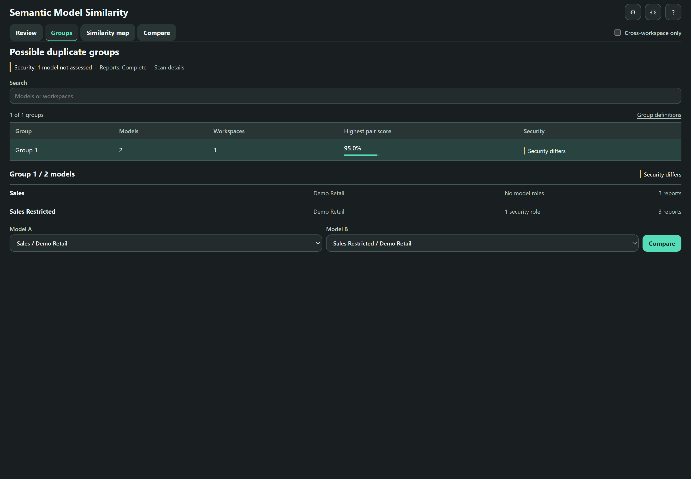
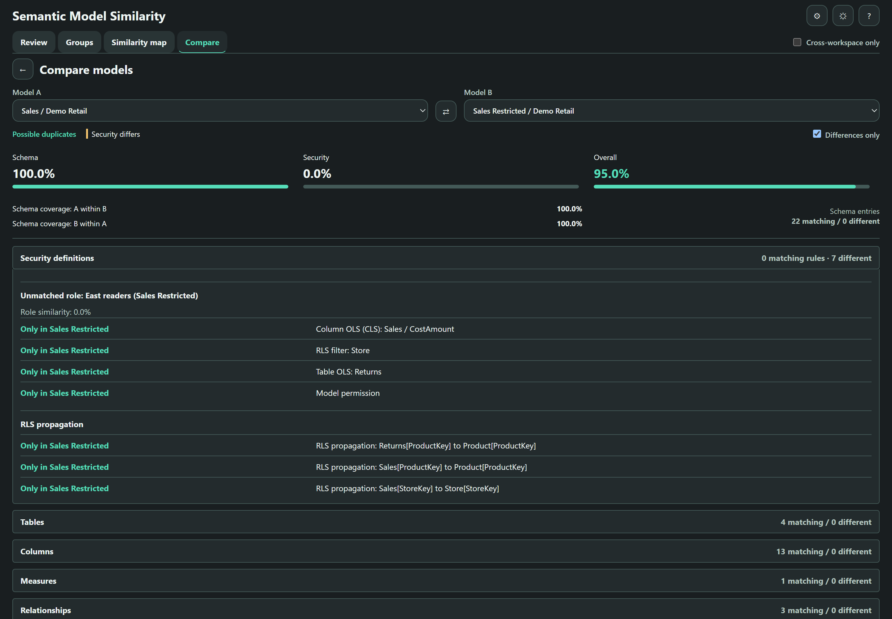
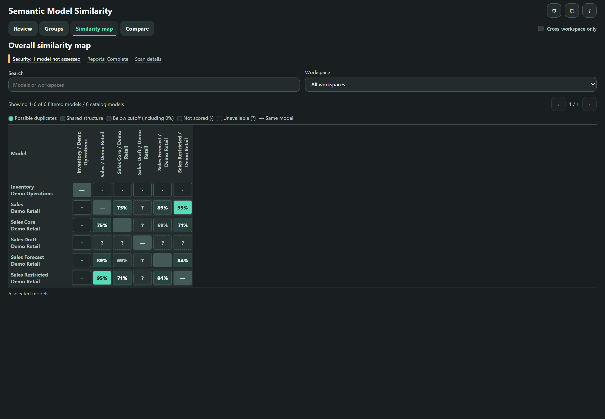

# Technical Reference

For requirements and a quick start, see the [project README](../README.md).

- [Catalog](#catalog)
- [Scoring](#scoring)
- [Results app](#results-app)
- [Configuration](#configuration)
- [Temporary workspace access](#temporary-workspace-access)
- [Limitations](#limitations)

## Catalog

The collection stage of notebook 001 uses Semantic Link Labs and TOM to read semantic model metadata through the notebook user's Fabric identity. Run it interactively in Fabric. It discovers workspaces and semantic models, optionally grants a dedicated group temporary workspace access, opens read-only TOM sessions, and extracts:

- semantic model properties, data sources, tables, and columns
- measures and DAX expressions
- relationships
- role permissions, RLS filters, table OLS, column OLS (CLS), and relationship security settings
- per-model security scan status, definition version, counts, and catalog scan ID
- model/workspace errors
- direct Power BI report-to-model bindings, including visible cross-workspace reports
- report workspace scan status, scope, and snapshot timestamp

The notebook writes these Delta tables to the attached Lakehouse:

- `semantic_models`
- `semantic_model_datasources`
- `semantic_model_tables`
- `semantic_model_columns`
- `semantic_model_relationships`
- `semantic_model_measures`
- `semantic_model_catalog_errors`
- `semantic_model_report_dependencies`
- `semantic_model_report_scan`
- `semantic_model_security`

### Security metadata

`semantic_model_security` is a typed current snapshot with one row per attempted model. It stores nested role/table/column definitions in `definition_json`, `security_schema_version`, `scan_status`, sanitized `error_type`, nullable counts, `catalog_scan_id`, and `scanned_at`. The same catalog scan ID is included in `semantic_models`. A successful zero-role scan is explicitly recorded; failed or partial reads have null definitions and counts, not invented empty security. This snapshot always overwrites, including when empty.

Collection follows TOM's `Model.Roles` -> `TablePermissions` -> `ColumnPermissions` hierarchy. Column-level security here means column OLS; `IsHidden` is not security. `MetadataPermission=None` is a literal permission value, distinct from an unavailable property. Relationship endpoints, active state, cardinalities, cross-filtering, and `SecurityFilteringBehavior` are captured for RLS propagation comparison. No model-role members or Entra group memberships are read or changed. Optional workspace-role changes are separate from model security collection.

The scanning identity must be allowed to inspect the complete model security metadata. Verify visibility against a known protected model before interpreting a role-free scan. A readable model is not proof of effective-user access, and matching dynamic filters do not prove matching access when identity mappings or source data differ. Security definitions can contain sensitive literal values; restrict access to the output Lakehouse and notebook results accordingly.

### Report dependencies

The catalog supports optional exact filters through `WORKSPACE_NAME` and `MODEL_NAME`. Report discovery is independent: `REPORT_WORKSPACE_NAME = None` scans the report workspaces visible to the notebook identity when temporary access is off, or active regular workspaces discovered by the admin API when it is on, even when model discovery is filtered. Set it to an exact workspace name to restrict report scanning. Cross-workspace dependents outside that report scope cannot be discovered.

Model and report scopes are combined by workspace ID, and each workspace is processed once. Reports are collected inside the same temporary-access window as model metadata. Their bindings are resolved against the complete catalog afterward, so an earlier workspace can contain a report bound to a model collected later. Empty model lists and model-name filter misses do not skip report collection. Enabled admin-discovery failures stop the run rather than silently falling back to a smaller visible scope.

The report inventory uses [Power BI Reports - Get Reports In Group](https://learn.microsoft.com/en-us/rest/api/power-bi/reports/get-reports-in-group). Bindings use `datasetId`, never model names. Reports with missing model IDs, unsupported report types (including paginated reports), or models outside the catalog remain explicit inventory rows. Missing IDs and unsupported report types make coverage partial; an out-of-catalog model ID remains an observed binding, but its model workspace is unknown.

Each report row includes the report ID, name, workspace, generated report URL, bound model ID, available model/workspace context, binding status, cross-workspace flag, `scan_id`, and `scanned_at`. Scan rows record counts and `complete`, `partial`, or `failed` status for each report workspace. Discovery failures also create a failed scan row. Only sanitized exception types are stored for report scans.

Report listing requires report read access and the appropriate API authorization (`Report.Read.All` or `Report.ReadWrite.All`); the notebook uses its existing Semantic Link identity. Reports still use the workspace-scoped report API, not a tenant-admin report scan. Optional temporary workspace membership does not replace API scopes or acquire/store credentials.

These two report tables are **current snapshots**, always overwritten, including when empty. They do not implement historical change tracking, usage analytics, transitive model lineage, field-level dependencies, report rebinding, or a safety recommendation to retire a model. All counts are limited to the caller's visible, selected scope, not a tenant-wide guarantee.

## Scoring

After collection and access cleanup, the scoring stage in the same notebook 001 reloads the persisted catalog tables and builds a normalized signature for each semantic model. It then:

- builds candidate pairs
- computes structural Jaccard overlap for tables, columns, measures, relationships, and data sources
- measures DAX/name similarity with a local TF-IDF vectorizer
- preserves the six-signal blend as the symmetric **schema similarity score**
- compares security definitions independently of role names to calculate **security similarity**
- calculates **combined similarity**, normally 95% schema plus 5% security
- computes directional **schema containment** from table, column, measure-definition, relationship, and data-source coverage, excluding security
- classifies pairs by combined score as `duplicate`, `similar`, or `distinct`; unavailable combined scores are `unassessed`
- labels schema containment as `equivalent`, `model_a_contains_model_b`, `model_b_contains_model_a`, or `partial_overlap`
- groups duplicate-tier pairs into connected clusters and writes results to the Lakehouse

The output tables are:

- `semantic_model_signatures` (schema counts, security scan status, canonical definitions, SHA-256 fingerprints, and provenance)
- `semantic_model_similarity_pairs` (`schema_score`, `security_score`, `combined_score`, `score_mode`, `security_comparison_status`, role alignment and component evidence in `security_evidence_json`, plus schema containment fields)
- `semantic_model_duplicate_clusters`
- `semantic_model_similarity_run` (thresholds, blocking flag, configured weight dictionaries, timestamp, counts, `analysis_run_id`, and `score_version=2`)

All scored outputs carry an analysis run ID. Pairs and signatures also record their source catalog IDs. `composite_score` retains its previous meaning as the rounded schema-only score for existing consumers; it is **not** an alias for the combined score. Classifications and clusters use `combined_score`.

### Score semantics

| Security metadata | Security score | Combined score |
| --- | --- | --- |
| Complete on both sides, with roles on either side | Definition similarity | `0.95 * schema_score + 0.05 * security_score` |
| Both complete scans have no roles | Not applicable (`null`) | Exactly `schema_score` |
| Only one model has roles, with complete scans on both sides | 0% | `0.95 * schema_score` |
| Missing, unreadable, partial, unsupported, or inconsistent | Unknown (`null`) | Unavailable (`null`) |

A role is a security definition even if it has no assigned members or no table filters, because its model permission still matters. Assignments are never inspected to determine applicability. `score_mode` distinguishes `combined`, `schema_only_no_security`, and `unavailable_security`.

For example, 100% schema and 0% security yield **95% combined**. The default duplicate cutoff is inclusive at 95%, so this pair still qualifies as a possible duplicate, with a **Security definitions differ** warning. There is no security-equality veto or security-specific minimum. If neither model has roles and schema is 90%, combined is exactly 90%, not 90.5%.

Schema, security, and combined similarity are symmetric. Containment is directional and schema-only: a pair can have moderate similarity yet high containment when a small model's schema definitions occur in a much larger one. None of these scores is a confidence rating or a percentage of data values.

### Security calculation

Roles are matched one-to-one by their rules using maximum-total-similarity assignment (`scipy.optimize.linear_sum_assignment`). Names are retained for display but do not affect matching. Role multiplicity and boundaries are preserved: splitting one combined role into separate roles is a difference, and one role cannot match multiple roles.

Within a role pair, model permission is an exact match, while RLS, table OLS, and column OLS facts use Jaccard overlap. These four families have equal default weights; families absent from both roles are excluded. Unmatched roles contribute zero, and matched role scores are divided by the larger role count. The security score blends this role-definition score with RLS propagation using default weights of 4:1. Propagation is applicable only when at least one model has RLS propagation facts; otherwise role definitions supply the whole score.

RLS expression text is compared exactly, preserving string literals, case, whitespace, and comment-like text. Formatting-only changes can therefore count as differences. Security does not reuse the schema DAX normalizer or TF-IDF. No-op `Default` table/column declarations are omitted from scoring, while their raw values remain in the catalog. A versioned SHA-256 fingerprint identifies exact canonical definition matches independently of rounded percentages. This is similarity of definitions, not a measure of security strength, compliance, or effective authorization.

Report dependencies are impact context only. They do not affect candidate blocking, similarity weights, containment, or duplicate clustering. Scoring is deterministic and local to the notebook environment; it does not rely on external embedding services or an external ML endpoint.

## Results app

The results notebook reads the persisted Delta tables into a self-contained Fabric `displayHTML(...)` app with four visible views:

- **Review** - a catalog-model count, scope-aware pair/group totals, and a ranked, sortable pair table for **Possible duplicates**, **Schema coverage**, and **Shared structure**, with all three scores and visible security states
- **Groups** - a summary table with model/workspace counts, highest pair score, and full-group security state; selecting a group reveals its members and pair selectors
- **Compare** - compact model selectors, schema/security/combined scores, both coverage directions, and expandable schema, security-rule, formula-text, report, and score evidence
- **Similarity map** - a filtered heatmap with explicit 40-model slices, separate zero/unscored/unavailable/outside-scope states, and focus/hover details; eligible cells open the matching comparison

The compact status strip keeps incomplete security/report evidence visible. The **?** control opens one keyboard-accessible **Definitions & scan details** dialog with methodology, report scope, snapshot time, and limitations. The dialog stays within the visible notebook output area and scrolls internally. **View generated** is the rendering timestamp, not an assertion about data freshness.

**Cross-workspace only** is a shared control beside the view tabs and starts off for each newly generated report. When enabled, it applies to Review, Groups, and the map using known, different workspace IDs, not workspace display names or a cached pair flag. Missing workspace IDs are not evidence of a cross-workspace comparison. Turning the control off includes all saved comparisons; it never recalculates scores or changes collected data. Its state is retained across tabs and Back navigation. The UI labels `combined_score` as **Overall**; stored fields, weights, and calculations are unchanged.

Review filters combine search, finding, workspace, and security state. Workspace/search filters match either model in a pair. Category counts use the same scoped and filtered population before the finding filter. The catalog-model count remains catalog-wide; candidate and group totals follow the shared scope but not Review's local filters. The table separately shows filtered counts. Numeric columns sort with unavailable values last, and pages contain 25, 50, or 100 rows. Clearing filters preserves the shared scope and selected score sort. Resetting thresholds does not reset the scope.

Group search and map filters are independent of Review filters, while comparison scope and thresholds are shared. Groups are rebuilt as connected components of qualifying duplicate links in scope. Same-workspace links cannot join groups or set **Highest pair score** when cross-workspace scope is enabled. Members from the same workspace may still connect through another workspace; groups are not all-to-all duplicate claims. The default group comparison uses the strongest eligible pair, and its second-model selector excludes out-of-scope choices. No eligible groups is a valid result, even if all-workspace duplicates exist.

Group identity is based on member IDs, not its display position. Compare's Back action restores the originating view, filters, selection, table position, and keyboard focus. In a notebook, it also brings the selected control back into view. Manual Compare remains available for any two models and labels an explicitly selected out-of-scope pair without changing its scores or the report scope.

The report uses Fabric-logo teal accents on neutral light/dark surfaces: `#117865` in light mode and `#55DDB9` in dark mode. Review and Groups explicitly left-align headers, values, and sort controls. Opaque hover, focus, and selected-row backgrounds prevent Fabric's host table colours from changing the contrast of the report text. UI acceptance checks use the deployed notebook output, including actual row hover and focus states, rather than only a standalone preview.

The standalone **Reports** tab remains omitted from navigation. Report collection, member counts in Groups, and **Dependent reports** in Compare remain available. The report inventory renderer is retained for later use.

### Scores and evidence

**Combined similarity** is the overall score, incorporating security when applicable. **Schema similarity** is the structural/text comparison, including measures and source definitions, not an exhaustive schema-equivalence check. **Coverage score: A within B** asks how much of A's cataloged schema definitions is represented in B. Extra content in B can lower schema similarity without lowering coverage of A.

The score breakdown separates the combined calculation, six schema-similarity signals, and applicable security components. Coverage appears separately in the comparison summary as **A within B** and **B within A**, with full model names available in accessible labels. Table-name, column-name, measure-name, relationship-link, and source-definition overlap compare shared unique entries with all unique entries across both models. DAX text similarity is TF-IDF text resemblance, not a count of matching formulas. Models without measures use structural or model names as a text fallback, labeled **Model text similarity**. Coverage instead includes normalized measure-name/formula-text matches and excludes signal categories absent from the source before rescaling the remaining weights. Per-signal coverage contributions are not saved, so cataloged difference counts cannot explain an exact weighted score gap.

Review uses aligned percentages and in-cell bars; Compare uses one three-score strip with percentage bars on a common 0%-100% scale. Bars represent displayed values, not weights. Unavailable and not-applicable values remain explicit labels, never zero bars. The three summary scores stay side by side on narrow screens, while wide analytical tables scroll within their labeled region. Coverage remains separate and is not a contributor to combined similarity.

The **Security definitions** section aligns role rules, supports differences-only viewing, and distinguishes RLS, table OLS, column OLS, and propagation differences. Rule values and formula bodies expand on selection without truncation. Compare defaults to **Differences only** and opens the relevant evidence section on drill-through; Reports is not automatically opened. Swapping models reverses the displayed coverage directions but does not change symmetric scores. Missing directions remain explicitly unavailable.

### Report counts

Groups includes compact per-model report counts, and Compare has a separate **Dependent reports** section without changing structural difference counts. Complete scoped snapshots show report counts; partial scans label counts as **known**; missing, inaccessible, or inconsistent snapshots show **Unknown**. Report scan completeness remains visible in the status strip and Reports detail. A verified zero count is still limited to the scanned scope.

Zero observed direct links does not prove a model is unused or that no dependencies exist outside the visible, selected scope. Scan IDs and per-workspace counts are checked before using dependency rows; the report snapshot timestamp is distinct from the view generation time. Check report scan scope, timestamp, and failures before interpreting impact counts.

### Thresholds and unscored pairs

**Review thresholds** displays percentage cutoffs while retaining unrounded combined score values for classification. Blank, nonfinite, or out-of-range entries cannot be applied. Applying a cutoff reclassifies existing scores and groups; it does not recalculate similarity or recover pairs omitted by blocking. Each candidate appears once, with possible duplicates taking priority over schema coverage, then shared structure. Default cutoffs are 95%/70%/95% for duplicates, similar pairs, and containment respectively. Similarity cutoffs apply to combined scores. Browser threshold preferences use a versioned key so old schema-only settings are not silently reused.

The Similarity map can search all catalog models, including models without scored pairs. It renders up to 40 filtered models on both axes at a time and labels the current slice and total counts; other models remain available through search, workspace selection, or paging. A numeric cell is the combined score, displayed as a rounded whole percentage. **Not scored** cells use a dot and mean the eligible pair is absent from the saved pair table, commonly because blocking excluded it. A scored **0%** remains a distinct, valid result. **Unavailable (?)** includes invalid combined scores and incomplete security evidence. **Outside scope (x)** marks same-workspace or unknown-workspace comparisons when cross-workspace scope is on; these cells expose their reason on focus/hover but cannot open Compare. Eligible non-diagonal cells can open Compare, including unscored pairs whose cataloged evidence can still be inspected.

### Implementation notes

The results notebook keeps presentation separate from scoring and has no external web dependencies. All preparation and renderer definitions are in one hidden-input cell (Cell 2), followed by the visible `render_results()` call (Cell 3). The UI output remains visible.

### Screenshots

These screenshots use synthetic demo data rendered by the results notebook in its desktop dark theme. Cross-workspace scope is switched off to show the complete synthetic pair and group examples.



*Groups show member models, scoped report counts, and security differences across the group.*



*The same synthetic pair has matching schema entries but different security definitions. Rules and formulas expand when needed; the summary stays compact.*



*The map separates scored, unscored, and unavailable pairs within the visible model slice. Select a cell to open Compare.*

## Configuration

Notebook 001 has **Configuration** and **Scoring Parameters** cells before collection. Both notebooks use the **default Lakehouse attached to the notebook**, so attach the same target Lakehouse before running. There is no database name to set.

Notebook 001 exposes the scan scope, blocking, tier thresholds and optional temporary access in its **Configuration** cell:

```python
WORKSPACE_NAME = None   # Optional exact workspace-name filter.
MODEL_NAME = None       # Optional exact model-name filter.
REPORT_WORKSPACE_NAME = None  # Independent report-workspace filter; None includes visible workspaces.

ENABLE_TEMPORARY_WORKSPACE_ACCESS = False
ACCESS_SECURITY_GROUP_ID = None
ACCESS_READY_TIMEOUT_SECONDS = 300
ACCESS_POLL_INTERVAL_SECONDS = 15

ENABLE_BLOCKING = True
DUPLICATE_THRESHOLD = 0.95
SIMILAR_THRESHOLD = 0.70
CONTAINMENT_THRESHOLD = 0.95            # Directional coverage at/above this flags a containment candidate.
```

This cell is tagged as the Fabric notebook **parameters** cell, so a pipeline, schedule or [Run On Demand Item Job](https://learn.microsoft.com/en-us/rest/api/fabric/core/job-scheduler/run-on-demand-item-job) request (`jobType=RunNotebook`) can override any of these scalar values through `executionData.parameters`. Keep it to literal assignments: Fabric injects overrides immediately after it. Because notebook parameters cannot pass `None`, a blank or whitespace-only filter name means unfiltered. The **Scoring Parameters** cell validates every value after injection: filters must be strings or `None`, flags must be booleans, and thresholds must be numbers greater than 0 and at most 1, with `SIMILAR_THRESHOLD` no higher than `DUPLICATE_THRESHOLD`. Weight dictionaries cannot be passed as notebook parameters.

`REPORT_WORKSPACE_NAME = None` includes all active regular admin-discovered workspaces when temporary access is enabled. Filters remain independent, and `MODEL_NAME` does not narrow permission scope. Personal, admin-monitoring, deleted and unknown workspace types/states are excluded from temporary grants.

Catalog and scoring writes replace their existing Delta tables and use explicit schemas, so typed empty writes clear stale rows. Each successful **001 -> 002** execution uses one current catalog and analysis result set. If no readable models are collected, the catalog is persisted and scoring stops; older score tables are not new results. Reads use registered table names (`spark.table`) to match `saveAsTable`, without assuming a physical `Tables/<name>` directory. Keep the Lakehouse/default schema consistent across both notebooks. Historical result retention and run selection are not supported; access recovery journals are separate operational records.

The **Scoring Parameters** cell holds the signal weights:

```python
SIMILARITY_WEIGHTS = {
    "tables": 0.15,
    "columns": 0.20,
    "measure_names": 0.15,
    "measure_dax_embedding": 0.25,
    "relationships": 0.15,
    "datasources": 0.10,
}

COMBINED_WEIGHTS = {"schema": 0.95, "security": 0.05}
SECURITY_WEIGHTS = {"role_definitions": 4.0, "rls_propagation": 1.0}
SECURITY_ROLE_WEIGHTS = {
    "model_permission": 1.0,
    "rls": 1.0,
    "table_ols": 1.0,
    "column_ols": 1.0,
}

# Containment uses exact measure definitions (name + DAX) instead of the TF-IDF
# embedding, because cosine similarity is symmetric and cannot prove a subset.
CONTAINMENT_WEIGHTS = {
    "tables": 0.15,
    "columns": 0.20,
    "measure_names": 0.15,
    "measure_definitions": 0.25,
    "relationships": 0.15,
    "datasources": 0.10,
}
```

`ENABLE_BLOCKING` keeps comparisons focused on model pairs that share at least one normalized table or measure name; disabling it performs a full pairwise comparison across every model in the catalog and is more expensive for large catalogs.

After upgrading the notebooks or changing model security, rerun **001 -> 002** against the same Lakehouse. Older or inconsistent outputs may still show schema scores but cannot provide security-inclusive combined scores. Use notebooks from the same release; public release versions are independent of persisted score/security schema versions.

## Temporary workspace access

This mode is opt-in. The interactive user must be a Fabric administrator with the required admin API authorization (`Tenant.ReadWrite.All`) and must already belong to the configured security group. Supply its **object UUID**, not a display name or email address. Use a group exclusively owned by this process: no permanent workspace assignments, manual role changes or overlapping runs, including runs using other notebooks or Lakehouses. Member access applies to every group member. The journal is not a distributed lock.

The lifecycle for every selected workspace is:

1. Persist grant intent in Lakehouse Files, then call `admin.add_user_to_workspace` with `role="Member"` and `principal_type="Group"`. There is no normal pre-grant assignment lookup, even if the running user already has access.
2. Retry read-access propagation within the configured budget, using actual model/report reads. Failed or ambiguous adds are reconciled through `admin.list_workspace_users`; only a process-owned Member assignment can be reused. Unexpected roles or uncertain outcomes stop the run.
3. Collect the selected model/security/report metadata. Close TOM connections, then remove the exact group assignment in `finally` using `admin.delete_user_from_workspace(..., is_group=True)`.
4. Verify assignment removal before processing the next workspace. Cleanup or journal failures stop further grants and prevent scoring. Ordinary model/report read errors remain recorded and best-effort once access is safely cleaned up.

Disabled mode does not inspect workspace assignments, grant access, revoke access or write journals. Model definitions, role memberships and report definitions are never changed by either mode. Temporary membership does not fix unavailable XMLA endpoints, capacity/licensing problems or missing API authorization; complete security visibility still needs verification on a known protected model.

Admin add/delete APIs document 200 requests per hour. Read/cleanup retries honor `Retry-After` within the bounded budget; a rate-limited add stops further grants instead of retrying blindly or moving to another workspace. `RefreshUserPermissions` is not called per workspace: it is limited to one call per user per hour and is not an immediate-propagation guarantee. Confirmed assignment removal also does not guarantee immediate invalidation of cached access or existing sessions.

### Recovery

Journals live under `Files/semantic-model-similarity/workspace-access/<group-id>/<run-id>/`. They contain exact workspace/group identifiers, requested role, UTC state transitions, safe exception types/statuses and cleanup results, not tokens or full user inventories. Intent is persisted and read back before each add; a journal failure after a successful add still triggers cleanup. Completed operational journals are retained independently of analytical snapshots.

An unfinished or corrupt journal blocks new grants. `finally` runs for normal Python exceptions and interruptions but cannot execute after a killed kernel or lost session. To recover, use the same Lakehouse and group, run setup/configuration and the access-helper cell without starting collection, and inspect the reported run. After confirming that the old run and any pending add requests have stopped, call `recover_workspace_access("<run-id>", confirm_stopped=True)`. This reconciles only that run's journaled workspace/group assignments and verifies removal. Unexpected roles, corrupt records or unresolved state require administrator review. Do not delete journals to bypass recovery. Once recovery succeeds, rerun notebook 001 from the start.

API references: [add workspace member](https://learn.microsoft.com/en-us/rest/api/power-bi/admin/groups-add-user-as-admin), [remove workspace member](https://learn.microsoft.com/en-us/rest/api/power-bi/admin/groups-delete-user-as-admin), [refresh user permissions](https://learn.microsoft.com/en-us/rest/api/power-bi/users/refresh-user-permissions), and [Semantic Link Labs admin functions](https://semantic-link-labs.readthedocs.io/en/stable/sempy_labs.admin.html).

## Limitations

Similarity and containment are metadata-based. Security comparison covers role definitions, not role assignments, group membership, effective-user authorization, workspace permissions, OneLake/SQL/source-system security, or enforcement tests. The workflow does not compare report layouts, visual configurations, row-level data, calculation results, refresh history or behavior, or business meaning outside captured metadata. Schema containment must not be interpreted as permission containment or replacement safety.

Metadata extraction is read-only, but running notebook 001 **does write** its output Delta tables and may execute its package-install cell. Enabling temporary access also changes the dedicated group's workspace-role assignments and writes recovery journals. These operations are separate from source-model inspection. The project does not provision Fabric workspaces or provide general data engineering setup.

Results depend on:

- the completeness and freshness of the TOM catalog
- name consistency across models
- the configured signal weights
- the blocking setting
- the lexical behavior of TF-IDF tokenization
- the selected duplicate, similar, and containment thresholds

Thresholds and weights should be calibrated against known model pairs before using the output as a governance or consolidation decision.